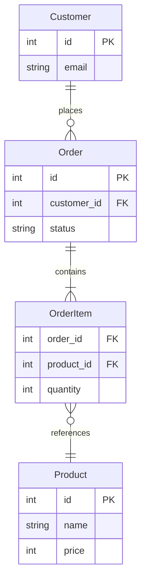
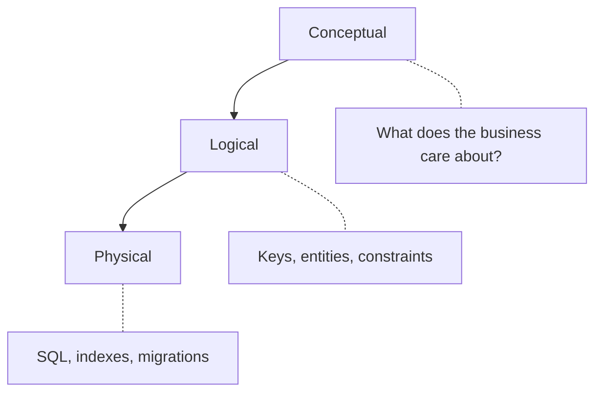

Every app eventually hits the same question: **how should we store this data?**

Get it wrong early and you're stuck with slow queries, duplicated records, and migrations that take forever. Get it right and everything else — APIs, analytics, reporting — just clicks.

That's what data modeling is. Think of it as the **blueprint** for your database before you write a single `CREATE TABLE`.

## The building blocks

A good model has four things:

- **Entities** — the "things" you track (users, orders, products)
- **Attributes** — properties of those things (email, price, created_at)
- **Relationships** — how entities connect (a user *places* many orders)
- **Constraints** — rules the database enforces (unique emails, non-null keys)

## ER Diagrams

The classic way to visualize a data model is an **Entity-Relationship (ER) diagram**. Here's what a simple online bookstore looks like:

The lines between boxes describe **cardinality** — how many of one thing relates to another:

- **1:1** — a User has one Profile
- **1:N** — a Customer places many Orders
- **M:N** — Students enroll in many Courses (needs a junction table in between)

## The three design layers

You don't go from idea straight to SQL. There are three layers, each answering a different question:

- **Conceptual** — high-level, no tech details. Just "a Subscription belongs to one Account." Great for aligning with non-engineers.
- **Logical** — precise entities, keys, and constraints. Still no `BIGINT vs UUID` debates.
- **Physical** — actual SQL, indexes, partitions, migrations.

> A common mistake is jumping straight to physical. Spend time at the top layers first — it's much cheaper to change your mind on a whiteboard than in production.

## Normalization (in plain English)

Normalization is just about **storing each fact once**. Without it, you get problems like:

- Changing a customer's city requires updating it in 10 different rows
- Deleting an order accidentally wipes product info you still need

The levels you'll actually care about:

| Normal Form | What it fixes |
|---|---|
| 1NF | No comma-separated lists in a single column |
| 2NF | Every column depends on the *whole* key, not just part of it |
| 3NF | No column depends on another non-key column |

Most apps aim for **3NF** and call it a day.

### When to break the rules

Sometimes you *want* duplicated data — like storing `product_name` on `order_item` to skip a join on a hot dashboard query. That's called **denormalization**, and it's fine as long as you've measured that you actually need it.

## The workflow

Data modeling isn't paperwork — it's how you make sure your database tells the truth, stays consistent, and doesn't become a nightmare to change six months from now.

Before you run `npx drizzle-kit generate` or write your first Prisma schema, spend 30 minutes on paper. The database is the hardest part of your stack to unwind. Design it deliberately.
